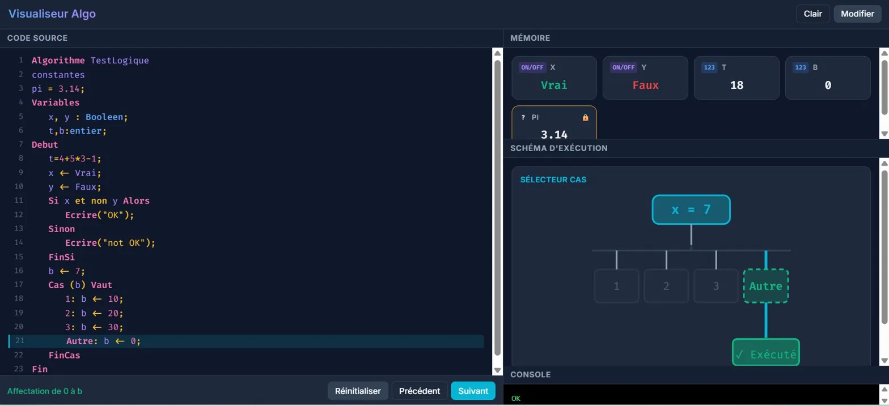
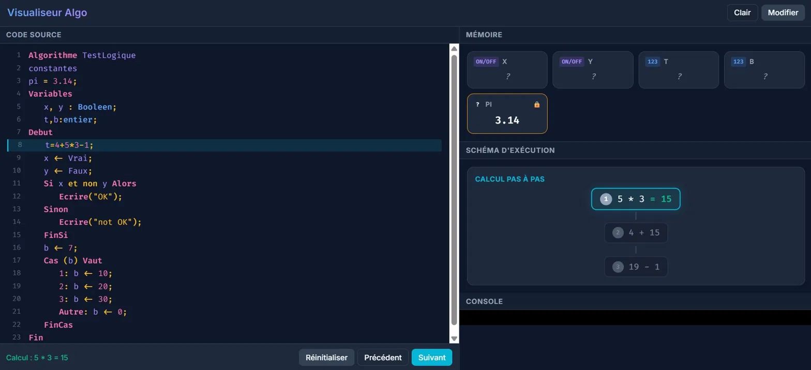
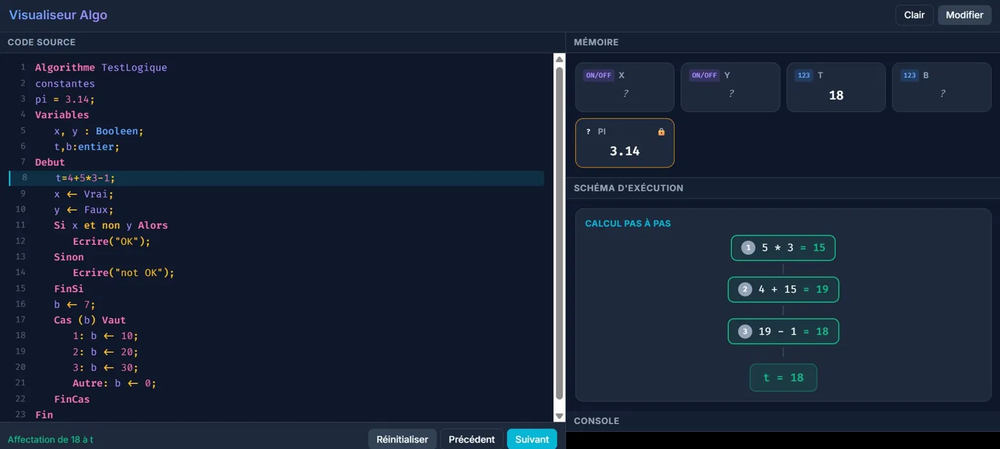
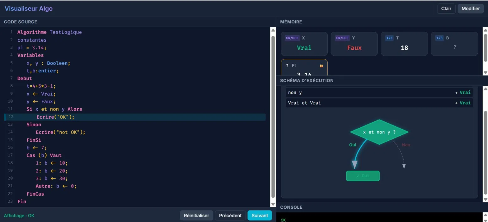

# Visualiseur Algo

## Contexte du projet

Un visualiseur interactif d'algorithmes basé sur la syntaxe enseignée dans les lycées marocains. Il permet aux élèves d'exécuter leurs algorithmes pas à pas, de voir les variables changer en mémoire, de comprendre l'évaluation des expressions arithmétiques et de suivre le fonctionnement des structures conditionnelles (Si, Cas/Vaut) à travers des schémas animés.

Développé dans le cadre d'un Projet de Fin de Formation au CRMEF de Rabat — Filière : Enseignement Secondaire Qualifiant, Spécialité : Informatique.

---

## Captures d'écran

| | |
|---|---|
| **Vue générale — structure Cas/Vaut** |  |
| **Calcul arithmétique — étape 1** (priorité multiplication) |  |
| **Calcul arithmétique — résultat final** |  |
| **Condition Si avec opérateurs logiques** (branche Oui) |  |

---

## Syntaxe supportée

L'interpréteur est **insensible à la casse** et ignore les **accents** sur les mots-clés pour faciliter la saisie sur smartphone.

### 1. Structure d'un algorithme

```
Algorithme NomDuProgramme
Variables
    a, b : Entier
Début
    // Instructions...
Fin
```

### 2. Types de données

- `Entier` : nombres entiers (ex. `10`)
- `Réel` : nombres à virgule (ex. `3.14`)
- `Chaîne` : texte entre guillemets (ex. `"Bonjour"`)
- `Caractère` : lettre unique entre guillemets (ex. `"A"`)
- `Booléen` : valeurs de vérité (ex. `Vrai`, `Faux`)

### 3. Affectation

L'opérateur `<-` est utilisé pour l'affectation (conforme à la syntaxe marocaine officielle).

```
a <- 5
b <- 10
```

### 4. Entrées / Sorties

```
Ecrire("Texte à afficher : ", a)
Lire(b)
```

### 5. Structures Conditionnelles (Si)

```
Si a > b Alors
    Ecrire("a est plus grand")
Sinon
    Ecrire("b est plus grand")
FinSi
```

### 6. Structure Cas/Vaut (choix multiple)

```
Cas (x) Vaut
    1: x <- 10;
    2: x <- 20;
    3: x <- 30;
    Autre: x <- 0;
FinCas
```

### 7. Opérateurs

- **Arithmétique** : `+`, `-`, `*`, `/`
- **Comparaison** : `>`, `<`, `>=`, `<=`, `=`, `<>`
- **Logique** : `ET`, `OU`, `NON`

---

## Comment exécuter le projet

### 1. Prérequis

- Python 3 installé sur la machine

### 2. Lancer le serveur

Ouvrez un terminal dans le dossier du projet et exécutez :

```
python api.py
```

### 3. Accéder à l'application

Ouvrez votre navigateur et allez sur :

```
http://localhost:8000
```

### 4. Accès depuis d'autres appareils (même réseau)

1. Autorisez le port `8000` dans le pare-feu Windows
2. Trouvez l'adresse IP de votre machine avec la commande :

```
ipconfig
```

3. Depuis un autre appareil connecté au même réseau, ouvrez le navigateur et allez sur :

```
http://<ADRESSE_IP>:8000
```

---

## Rapport et vidéo de démonstration

- [Google Drive — Rapport PDF + Vidéo](https://drive.google.com/drive/folders/1AMFwzQ6UbJsw7iPenWemGnbJfSWtqNJx)

---

## Instructions pour ajouter de nouveaux mots-clés

Pour enrichir l'interpréteur, par exemple en rajoutant de nouvelles fonctions ou structures :

1. **Dans `lexer.py` :**
   - Ajoutez le nouveau token à l'enum `TokenType`.
   - Liez le mot-clé en français dans le dictionnaire `KEYWORDS`.

2. **Dans `parser.py` :**
   - Ajoutez le nouveau nœud dans l'Arbre de Syntaxe Abstraite (`ASTNode`).
   - Ajoutez une nouvelle fonction ou mettez à jour `statement()`/`expression()` pour lier les tokens générés par le lexer à la règle de grammaire.

3. **Dans `interpreter.py` :**
   - Modifiez `execute()` ou `evaluate()` pour ajouter la logique d'exécution liée à la nouvelle expression ou instruction.

---

## Mode "Trace" (Débogage visuel)

L'interpréteur intègre un mode "Trace" idéal pour la pédagogie :
En ajoutant `--trace` lors de l'exécution, vous afficherez l'état complet de la "mémoire" (valeurs des variables) à chaque ligne exécutée, ce qui permet à l'élève de comprendre le déroulement pas à pas !

```bash
python main.py exemple_a_tester.txt --trace
```
